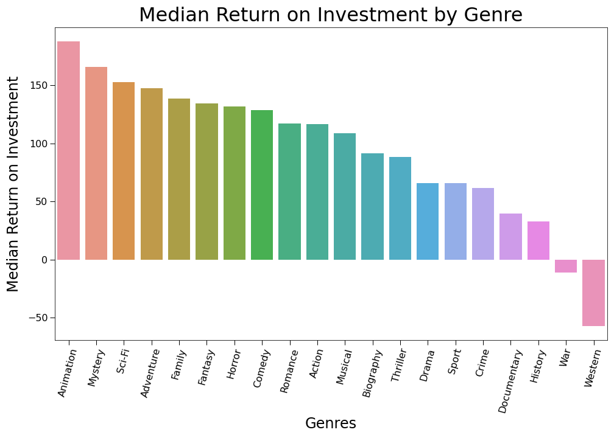
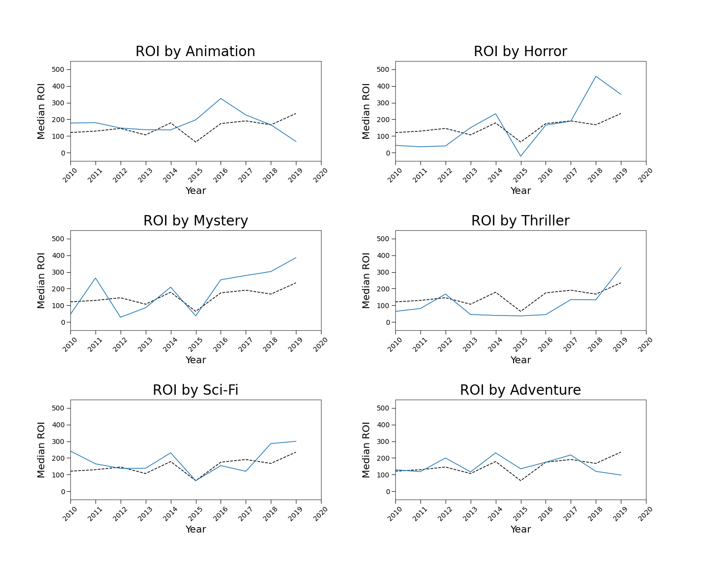
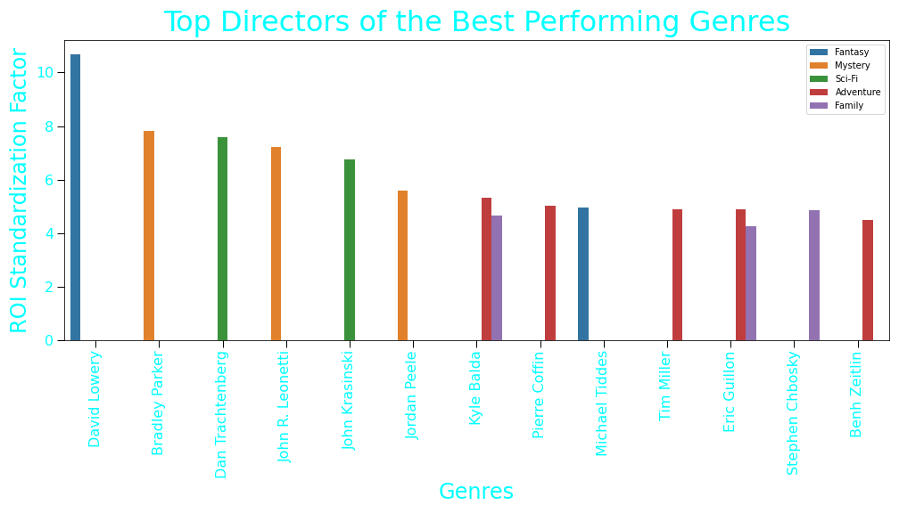

# Microsoft Movie Recommendation

**Authors**: Jocel Arcelona, Josh Gottlieb, Josh Palgon

## Overview

We were tasked with providing Microsoft with a recommendation on how to get into the movie making business by looking at what films are currently doing well in the box office. Our chosen measure of successs is Return on Investment, which is calculated as Worldwide Profit / Production Budget. Our data sources had information only on box office revenue, not other sources such as streaming or downloads. Our data sources are The Numbers (`tn.movie_budgets.csv`), The Movie Database (`tmdb.movies.csv`), Box Office Mojo (`bom.movie_gross.csv`), and IMDb (`im.db`). 

To clean out data, we dropped all data that could not be joined by movie title and only looked at data from 2010-2019. We decided to use this method, as our budget data only had title to use to link with our other data, and the business question only cares about recent data. We did not have useable information from 2020 onwards, so we chose 2010-2019 to have a ten year period up to our most current data. 

Mystery and Sci-Fi are our top choices for best genres to produce, given their high median return on investment and upward trend in the most recent years. Animation is the highest performing genre by median return on investment in our data set but has been on the decline recently, so we would not recommend producing in Animation. Horror and Thriller are genres that are worth keeping tabs on due to their upward trend but it would be best to see if the trend continues. 


## Business Problem

Microsoft wants to enter the movie business, but they do not know what type of movie to make. They want to know which movies are currently doing the best at the box office, so that they can understand what kind of movie to produce.

Our business problem is quite vague, as there are no particular variables we are required to focus on. Success is also not defined for us. Therefore, we chose to focus on money overall, specifically the return on investment (ROI) for each movie. ROI is calculated by dividing the worldwide profit by the production costs.

ROI is an important metric because it represents a measurement of profitability of a venture that can be used to compare alteranatives with different investment sizes. For example, if a project costs $100 and makes a profit of $200, and another project costs $10,000 and makes a profit of $20,000, they both have an ROI of 200%. This allows us to normalize profits between cheap and expensive movies.

One pitfall of using return on investment is that it introduces some instability into our calculations because movies which have a very low budget with a medium-high nominal profit will have an inflated ROI. For a company of Microsoft's size, they may prefer to have a lower return on investment per project but make larger sums of money overall. However, we believe that ROI is useful for showing the overall profitability of a movie and is one of the better single factors to consider outside of a more extensive multi-dimensional analysis.


## Data

We incorporated data from The Numbers (`tn.movie_budgets.csv`), The Movie Database (`tmdb.movies.csv`), Box Office Mojo (`bom.movie_gross.csv`), and IMDb (`im.db`). We pulled budget and revenue information from the Box Office Mojo and The Numbers datasets. Genre information was pulled from The Movie Database and IMDB, whie directors and writers were pulled solely from IMDB.

As part of merging our data sets, we focused mainly on merging via titles, with release date acting as a secondary key. Our sample size dropped significantly due to a lack of overlap between data sets.

Once we had our data merged, we determined that we had the most information with regards to genre, director, and writer.


## Methods

After merging our data and performing initial analysis, we realized that there were signficant outliers within the horror genre. The titles 'The Devil Inside' and 'The Gallows' had small budgets with relatively large revenue, but after researching these two films, we learned both films made all of their money during the first week at the box office and then were complete failures. We decided these movies were atypical and not representative of our data as a whole. In a similar fashion, we discovered that the 3 movies in our data set from 2020 had no revenue information, despite a cursory web search revealing that these movies had indeed made money. Presumably, our data was missing this information, so we decided to drop the few titles that we had from 2020.

As part of our analysis, we grouped our data along each of our categorical variables. We began by analyzing Median/Mean ROI with respect to genre, director, and writer individually. We then analyzed the distribution of ROI by genre, as well as a breakdown of successful directors and writers by genre. We also looked at how median ROI by genre changed from year to year to analyze the trend of each genre across time.


## Results

### Median ROI by Genre


Animation, Mystery and Sci-Fi are the top performing genres from 2010-2019.

### Top Genres by ROI Over Time


However Animation has not been trending well, while Mystery and Sci-Fi are still performing strong at the end of the timeframe. 

Horror and Thriller are trending upward despite not being top 5. 

### Top Directors


David Lowery is the top performing director and writer despite being in the fantasy genre that is not top 5.


If any of these graphs are hard to look at due to the web browers settings please look at our full analysis in [our Jupyter Notebook](./notebooks) or our [presentation](./Movie_Presentation.pdf).

## Conclusions

Invest in Mystery and Sci-Fi movies due to their high ROI and recent trend.

Monitor Horror and Thriller movies due to their recent trend. Invest in them if they continue to yield high ROIs.

Make a Fantasy move with David Lowery as the Director and Writer.

Gather more data to look at Parental Ratings, User Ratings and get the most recent years data as well as fill in any gaps in the 2010-2019 data. The density of sentiment from users usually determines the popularity of a genre and it dictates the current trend, what most viewers want to watch or what movies interests them.

Provide your conclusions about the work you've done, including any limitations or next steps.


## For More Information

Please look at our full analysis in [our Jupyter Notebooks](./notebooks) or our [presentation](./Movie_Presentation.pdf).

For any additional questions, please contact **Jocel Arcelona (jocelarcelona30@gmail.com), Josh Gottlieb (joshuadavidgottlieb@gmail.com), or Josh Palgon (jopalgon@gmail.com)**.

## Repository Structure

Describe the structure of your repository and its contents, for example:

```
├── README.md                           <- The top-level README for reviewers of this project
├── dsc-phase1-project-template.ipynb   <- Narrative documentation of analysis in Jupyter notebook
├── DS_Project_Presentation.pdf         <- PDF version of project presentation
├── data                                <- Both sourced externally and generated from code
└── images                              <- Both sourced externally and generated from code
```
